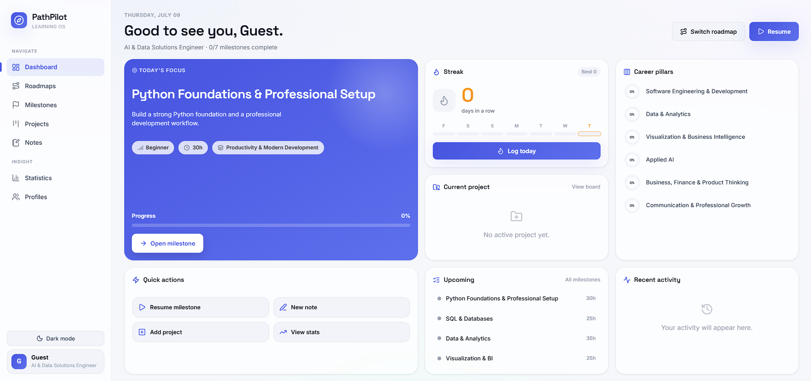
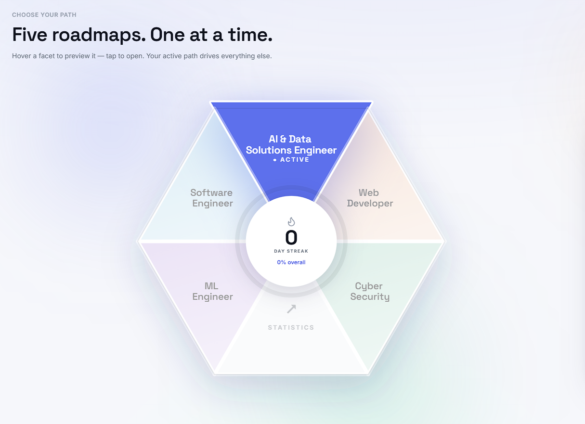
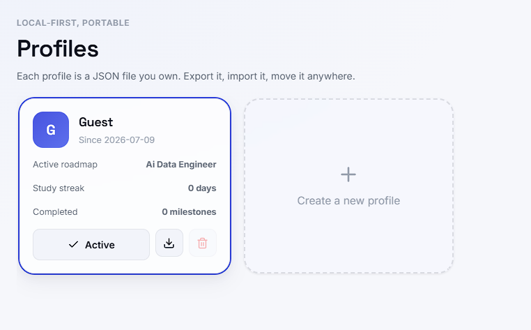

<div align="center">

# 🚀 PathPilot

### A Modern local-first Career Roadmap and Learning Tracker<br>Built with Flask, SQLite and Vanilla JavaScript

Track your learning, manage milestones, complete projects and stay focused on your career path.

---


</div>

---

# 📸 Screenshots

## Dashboard



---

## Career Paths



---

## Profiles



---

# ✨ Features

- 🎯 Five built-in Career Roadmaps
- 📚 Milestones & Learning Goals
- 👤 Multiple User Profiles
- 📈 Progress Tracking
- 📝 Notes System
- 💻 Project Management
- 📊 Statistics Dashboard
- 💾 Local SQLite Database
- 🌐 Runs Completely Offline
- 🎨 Modern Responsive Interface
- 📦 Import & Export Profiles (JSON)

---

# 🛣 Built-in Career Paths

- 🤖 AI & Data Engineer
- 💻 Software Engineer
- 🌐 Web Developer
- 🧠 ML Engineer
- 🛡 Cyber Security

---

# 🛠 Tech Stack

**Frontend**

- HTML5
- CSS3
- JavaScript

**Backend**

- Python
- Flask
- SQLite

**Libraries**

- Chart.js
- Animate.css
- Lucide Icons

---

# 🚀 Getting Started

## 1. Clone the Repository

```bash
git clone https://github.com/YOUR_USERNAME/PathPilot.git
cd PathPilot
```

## 2. Create a Virtual Environment (Optional)

```bash
python -m venv .venv
```

Windows

```bash
.venv\Scripts\activate
```

Linux / macOS

```bash
source .venv/bin/activate
```

---

## 3. Install Dependencies

```bash
pip install -r requirements.txt
```

or

```bash
pip install flask pywebview pyinstaller
```

---

## 4. Run the Web Version

```bash
python app.py
```

Open your browser:

```
http://127.0.0.1:5000
```

---

# 🖥 Desktop Mode

PathPilot can also run as a native Windows desktop application without opening your browser.

Simply run:

```bash
python launcher.py
```

---

# 📦 Build a Windows Executable

Install the required packages:

```bash
pip install pyinstaller pywebview
```

Build the application:

### PowerShell

```powershell
pyinstaller --onedir --windowed --name PathPilot `
--add-data "templates;templates" `
--add-data "static;static" `
--add-data "roadmaps;roadmaps" `
--add-data "profiles;profiles" `
--add-data "data;data" `
launcher.py
```

### Command Prompt (cmd)

```cmd
pyinstaller --onedir --windowed --name PathPilot ^
--add-data "templates;templates" ^
--add-data "static;static" ^
--add-data "roadmaps;roadmaps" ^
--add-data "profiles;profiles" ^
--add-data "data;data" ^
launcher.py
```

The executable will be created in:

```text
dist/
└── PathPilot/
    └── PathPilot.exe
```

Simply launch **PathPilot.exe**.

---

# 📂 Project Structure

```text
PathPilot/
│
├── data/
├── profiles/
├── roadmaps/
├── screenshots/
├── static/
├── templates/
├── app.py
├── db.py
├── launcher.py
├── README.md
└── requirements.txt
```

---

# 🎯 Purpose

PathPilot was built as a portfolio project to provide a clean, structured way of following software engineering roadmaps while keeping progress, projects and notes in one place.

Unlike generic task managers, PathPilot focuses on guided learning through predefined career paths.

---

## 📄 License

This project is for Educational and Portfolio Purposes.

---

<div align="center">

Made with 🤍 using Flask & Vanilla JavaScript

</div>
